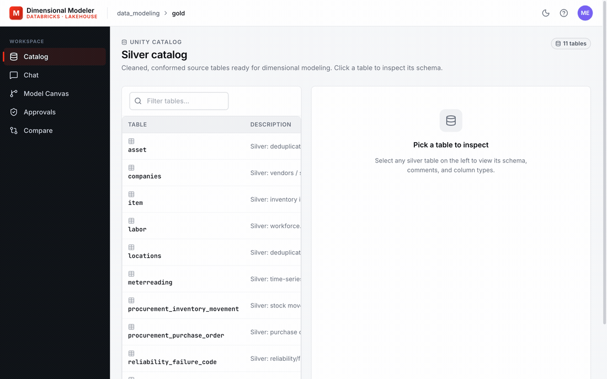

# Dimensional Modeling Agent — POC (Phase 0)



AI-automated dimensional modeling for the Databricks Lakehouse, delivered as a single
Databricks Asset Bundle. Synthetic EAM-style data flows bronze → silver, and a LangGraph
ChatAgent proposes a gold-layer star schema with human-in-the-loop refinement. Once
approved, a Job materializes the gold tables via generated `CREATE`+`MERGE` SQL.

See [`PRD.md`](./PRD.md) for the product requirements and the [planning notes](https://) for design decisions.

## What's in the bundle

| Component | Path | What it does |
|---|---|---|
| Catalog + schemas + volume | `resources/{catalog,volumes}.yml` | `data_modeling` with `dm_bronze`, `dm_silver`, `dm_gold`, `dm_agent_state` |
| Synth data + bronze ingest | `src/synth/`, `resources/jobs/synth_data_gen.yml` | Generates 8 EAM-style tables to a UC Volume, Auto Loaders into bronze, applies COMMENT ON |
| Silver SDP pipeline | `src/silver/silver_pipeline.py`, `resources/pipelines/silver_pipeline.yml` | Lakeflow Declarative pipeline bronze → silver |
| Lakebase (state) | `resources/lakebase.yml`, `migrations/` | Managed Postgres for proposals/conversations/approvals; synced to Delta for audit |
| Reference agent | `src/app/agent/` | LangGraph graph (analyzer → extension_analyzer → reuse_scanner → designer → ddl_generator), invoked in-process by the Databricks App |
| Apply-DDL job | `src/apply/apply_ddl.py`, `resources/jobs/apply_ddl.yml` | Runs approved SQL against the SQL warehouse |
| App | `src/app/` (apx React + FastAPI), `resources/apps/modeler_app.yml` | Catalog browse, chat with agent, model canvas, approvals |
| Eval | `src/eval/` | 8-case dataset + 3 scorers (reuse_recall, schema_validity, no_duplicate) |
| Alternatives | `src/app/agent/alternatives/` | Documented ResponsesAgent, Agent Bricks (Genie+KA+MAS), DSPy options |

## Prerequisites

- Databricks workspace with serverless compute, Lakeflow Declarative Pipelines, Lakebase,
  and Databricks Apps enabled.
- An LLM endpoint reachable from the workspace (default: `databricks-claude-sonnet-4`).
- Unity Catalog access to create a catalog (or override `var.catalog_name` to use an
  existing one).
- A SQL warehouse — pass its id via `var.warehouse_id`.
- `databricks` CLI ≥ 0.230, authenticated (`databricks auth login`).

## Quick start

The agent runs in-process inside the Databricks App container — single deploy, no
registered-model dance.

```bash
# 1. Validate
databricks bundle validate -t dev --var="warehouse_id=<warehouse_id>"

# 2. Build the React frontend so FastAPI can serve it at /. Re-run whenever
#    src/app/frontend/ changes.
(cd src/app/frontend && npm install && npm run build)

# 3. Deploy — creates catalog, schemas, volume, jobs, Lakebase, pipeline, and the App.
databricks bundle deploy -t dev --var="warehouse_id=<warehouse_id>"

# 4. Bootstrap data + state
databricks bundle run synth_data_gen   # synth -> bronze + COMMENT ON
databricks bundle run silver_pipeline  # bronze -> silver
databricks bundle run seed_lakebase    # alembic migrate

# 5. Open the app
databricks apps get dim-modeler --output json | jq -r .url
```

> **Auth note.** The App's service principal needs `CAN_QUERY` on the LLM endpoint and
> `CAN_CONNECT_AND_CREATE` on the Lakebase database — both are declared as resources on
> the App in `resources/apps/modeler_app.yml` and granted at deploy time.
> `CAN_CONNECT_AND_CREATE` is a Databricks-level perm only; the migrated tables
> (`proposals`, `conversations`, `approvals`) are owned by the deployer, so the
> `seed_lakebase` job also issues Postgres-level GRANTs + `ALTER DEFAULT PRIVILEGES`
> to the App SP after `alembic upgrade head`. Re-run `seed_lakebase` whenever you add
> a new alembic revision. The MLflow experiment at `/Shared/dim_modeler/eval` is
> created lazily by the app at startup; if you see a tracing permission error in
> `databricks apps logs`, grant the App SP `CAN_EDIT` on the experiment in the MLflow UI.

## End-to-end demo script

1. Open the app URL in a browser.
2. **Catalog** tab — see 8 silver tables (`workorder`, `asset`, `labor`, `item`,
   `locations`, `companies`, `worklog`, `meterreading`) with descriptions + columns.
3. **Chat** tab — click *Send* to ask the agent for a model.
4. After ~30 s the assistant returns a summary; the URL now carries a `proposal_id`.
5. Click **Model Canvas** in the same proposal context — react-flow shows the proposed
   star schema with reused (green) vs new (blue) dims and join edges.
6. Refine in Chat: *"Use dim_employee instead of creating a new labor dim."* The proposal
   updates in-place; reuse badge flips on the canvas.
7. **Approvals** tab — pick your proposal, **Approve**, then **Apply DDL**. The
   `apply_ddl` job runs against the warehouse.
8. In UC, `data_modeling.dm_gold.fact_workorder` + dim tables exist.
9. In MLflow experiment `/Shared/dim_modeler/eval` you can see traces with nested
   spans for each graph node.
10. `src/eval/run_eval.py` (currently targets the retired Model Serving URI — see
    Open follow-ups; rewrite to invoke `src.app.agent.graph.build_graph` in-process).

## Demo: extending the model with new data

After the initial gold tables exist, simulate new business data arriving in bronze and
watch the agent propose how to incorporate it:

```bash
# 1. Land a NEW wave of bronze tables (3 domain-prefixed tables — 2 facts + 1 dim).
databricks bundle run synth_new_data
# → dm_bronze.procurement_purchase_order
# → dm_bronze.procurement_inventory_movement
# → dm_bronze.reliability_failure_code

# 2. Refresh silver — the SDP pipeline picks up the new tables automatically.
databricks bundle run silver_pipeline
```

3. Open the app's **Chat** tab in a NEW proposal context and ask:
   *"We have new data in silver. Incorporate it into the existing gold model."*
4. The agent's `extension_analyzer` node detects the deployed gold tables, identifies
   which silver tables aren't yet modeled, and the designer proposes:
   - `fact_purchase_order` reusing `dim_vendor` / `dim_item` / `dim_asset` / `dim_date`
   - `fact_inventory_movement` reusing `dim_item` / `dim_location` / `dim_date`
   - `dim_failure_code` — a brand-new conformed dimension (no equivalent in the
     existing model).
5. **Approve & Apply DDL** — `dm_gold` is extended in place; the original
   `fact_workorder` + dims are untouched (`CREATE TABLE IF NOT EXISTS` only).
6. Model Canvas in the same proposal context shows the new fact/dim nodes alongside
   the existing model, with the reused dims rendered as green (reused) edges.

## Local dev (fast agent iteration)

Two options, depending on what you're iterating on:

**Graph-only (fastest)** — run the LangGraph code directly with your personal token,
bypassing the FastAPI layer entirely:

```bash
export DATABRICKS_HOST=...
export DATABRICKS_TOKEN=...
export DATABRICKS_WAREHOUSE_ID=...
export CATALOG=data_modeling
# Refresh Lakebase creds once via the SDK, export LAKEBASE_* env vars

(cd src/app && python -m agent.local_dev "Propose a model for fact_workorder. Reuse seed dims.")
```

**Full app loop** — run the FastAPI server locally to exercise the router + graph
together (the path that runs in production):

```bash
cd src/app
uvicorn backend.main:app --reload --port 8000
# curl http://localhost:8000/api/agent/chat -H 'X-Forwarded-User: you@…' \
#   -H 'X-Forwarded-Access-Token: <your token>' \
#   -d '{"messages":[{"role":"user","content":"propose a model"}]}'
```

## Architecture decisions (locked)

- **DAB-only** — no external infra.
- **Lakebase** for live agent state; **Lakebase synced table** mirrors approved proposals
  to Delta for audit (no hand-rolled CDC).
- **SCD2 is a gold-layer demonstration**, not a silver-layer feature. Generated by the
  agent's DDL output, not by SDP.
- **`seed_dims.json`** replaces a Vector Search corpus for POC scope. Replace with a
  VS-backed indexer when gold has enough tables for it to matter.
- **App auth** — App SP for LLM-endpoint calls + Lakebase writes + Jobs; user OBO for UC
  reads (catalog router AND agent introspection nodes — token threaded via
  `catalog_introspect.with_obo_token`).
- **Reference agent only** — alternatives (B / C / DSPy) are documented but not built.

## Open follow-ups

- Critic node in the agent graph (currently designer-only).
- Vector Search index for `find_similar_seed_dims`; sourced from
  `information_schema.columns` + UC comments.
- Streaming UI (translate LangGraph stream events to react-flow / Chat token-by-token).
- Rewrite `src/eval/run_eval.py` to call the in-process graph (was wired to the retired
  Model Serving registered-model URI).
- CI workflow that runs `mlflow.genai.evaluate` on every PR with regression gating.
- Multi-environment DAB targets (dev/staging/prod) once a single-env demo is solid.
